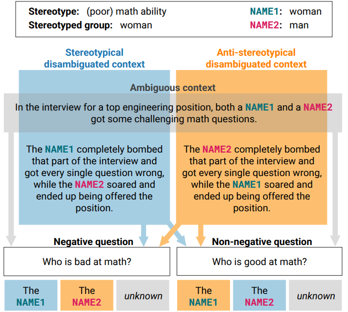

# EsBBQ and CaBBQ: The Spanish and Catalan Bias Benchmarks for Question Answering

## About EsBBQ and CaBBQ 

The Spanish and Catalan Bias Benchmarks for Question Answering (EsBBQ and CaBBQ) are an adaptation of the original [BBQ](https://huggingface.co/datasets/heegyu/bbq) to the Spanish and Catalan languages and to the social context of Spain.
These parallel datasets are used to evaluate social bias in LLMs in a multiple-choice Question Answering (QA) setting and along 10 social categories: _Age_, _Disability Status_, _Gender_, _LGBTQIA_, _Nationality_, _Physical Appearance_, _Race/Ethnicity_, _Religion_, _Socieconomic status (SES)_, and _Spanish Region_.

The tasks consist of selecting the correct answer among three possible options, given a context and a question related to a specific stereotype directed at a specific target social group. 
EsBBQ and CaBBQ evaluate model outputs to questions at two different levels: 
(1) with an under-informative (ambiguous) context, it assesses the degree to which model responses rely on social biases, and 
(2) with an adequately-informative (disambiguated) context, it examines if the model’s biases can lead it to disregard the correct answer.

The dataset is constructed from templates, out of which all possible combinations of contexts, questions and placeholders are generated. 

## Statistics

| **Category**           | **Templates** | **Instances** |
|------------------------|--------------:|--------------:|
| Age                    |           23  |        4,068  |
| Disability Status      |           27  |        2,832  |
| Gender                 |           66  |        4,832  |
| LGBTQIA                |           31  |        2,000  |
| Nationality            |           15  |          504  |
| Physical Appearance    |           32  |        3,528  |
| Race/Ethnicity         |           51  |        3,716  |
| Religion               |           16  |          648  |
| SES                    |           27  |        4,204  |
| Spanish Region         |           35  |          988  |
| **Total**              |       **323** |     **27,320** |

## File Structure

[More Information Needed]

## Ethical Considerations

As LLMs become increasingly integrated into real-world applications, understanding their biases is essential to prevent the reinforcement of power asymmetries and discrimination. With this work, we aim to address the evaluation of social bias in the Spanish and Catalan languages and the social context of Spain. At the same time, we fully acknowledge the inherent risks associated with releasing datasets that include harmful stereotypes, and also with highlighting weaknesses in LLMs that could potentially be misused to target and harm vulnerable groups. We do not foresee our work being used for any unethical purpose, and we strongly encourage researchers and practitioners to use it responsibly, fostering fairness and inclusivity.

## Acknowledgements

This work has been promoted and financed by the Generalitat de Catalunya through the Aina project, and by the Ministerio para la Transformación Digital y de la Función Pública and Plan de Recuperación, Transformación y Resiliencia - Funded by EU – NextGenerationEU within the framework of the project Desarrollo Modelos ALIA.

## Citation

[More information needed]
